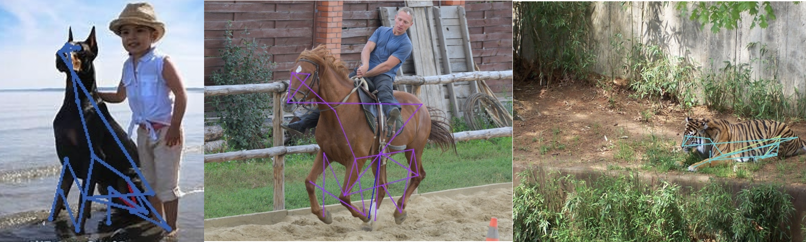

# Animal Pose Estimation Using Higher HRNet

<br>

This project is based on the Higher HRNet model proposed by Bowen Cheng, Bin Xiao, Jingdong Wang, Honghui Shi, Thomas S. Huang and Lei Zhang
Original Higher HRNet paper -> https://arxiv.org/abs/1908.10357

#### Citation

````
@inproceedings{cheng2020bottom,
  title={HigherHRNet: Scale-Aware Representation Learning for Bottom-Up Human Pose Estimation},
  author={Bowen Cheng and Bin Xiao and Jingdong Wang and Honghui Shi and Thomas S. Huang and Lei Zhang},
  booktitle={CVPR},
  year={2020}
}

@inproceedings{SunXLW19,
  title={Deep High-Resolution Representation Learning for Human Pose Estimation},
  author={Ke Sun and Bin Xiao and Dong Liu and Jingdong Wang},
  booktitle={CVPR},
  year={2019}
}

@article{wang2019deep,
  title={Deep High-Resolution Representation Learning for Visual Recognition},
  author={Wang, Jingdong and Sun, Ke and Cheng, Tianheng and Jiang, Borui and Deng, Chaorui and Zhao, Yang and Liu, Dong and Mu, Yadong and Tan, Mingkui and Wang, Xinggang and Liu, Wenyu and Xiao, Bin},
  journal={TPAMI},
  year={2019}
}
````
#### Animal Pose Dataset (AP-10k)
Authors:
  - name: "MMPose Contributors"
title: "OpenMMLab Pose Estimation Toolbox and Benchmark"
date-released: 2020-08-31
url: "https://github.com/open-mmlab/mmpose"
license: Apache-2.0

## Requirements
1. Install pytorch >= v1.1.0 following [official instruction](https://pytorch.org/).  
   - **Tested with pytorch v1.4.0**
2. Clone this repo, this cloned directory will be the ${POSE_ROOT}.
3. Installing dependencies:
   ```
   pip install -r requirements.txt
   ```
4. Install [COCOAPI](https://github.com/cocodataset/cocoapi):
   ```
   # COCOAPI=/path/to/clone/cocoapi
   git clone https://github.com/cocodataset/cocoapi.git $COCOAPI
   cd $COCOAPI/PythonAPI
   # Install into global site-packages
   make install
   # Alternatively, if you do not have permissions or prefer
   # not to install the COCO API into global site-packages
   python3 setup.py install --user
   ```

5. Install [CrowdPoseAPI](https://github.com/Jeff-sjtu/CrowdPose) exactly the same as COCOAPI.  

6. Init output(training model output directory) and log(tensorboard log directory) directory:

   ```
   mkdir output 
   mkdir log
   ```

   Your directory tree should look like this:

   ```
   ${POSE_ROOT}
   ├── data
   ├── experiments
   ├── lib
   ├── log
   ├── models
   ├── output
   ├── tools 
   ├── README.md
   └── requirements.txt
   ```

7. Download pretrained models from the model zoo([GoogleDrive](https://drive.google.com/open?id=1bdXVmYrSynPLSk5lptvgyQ8fhziobD50) or [OneDrive](https://1drv.ms/f/s!AhIXJn_J-blW4AwKRMklXVzndJT0))
   ```
   ${POSE_ROOT}
    `-- models
        `-- pytorch
            |-- imagenet
            |   `-- hrnet_w32-36af842e.pth
            `-- pose_coco
                `-- pose_higher_hrnet_w32_512.pth

   ```
   
### Data preparation

For the Animal Pose dataset I have used the AP-10k dataset [https://github.com/AlexTheBad/AP-10K], I then restructured the images and json annotation files to look like the COCO dataset. Rename the annotation files to person_keypoints_train2017.json and person_keypoints_val2017.json. Add the animal images inside the folders titled train2017 and val2017

```
${POSE_ROOT}
|-- data
`-- |-- coco
    `-- |-- annotations
        |   |-- person_keypoints_train2017.json
        |   `-- person_keypoints_val2017.json
        `-- images
            |-- train2017
            |   |-- 000000000009.jpg
            |   |-- 000000000025.jpg
            |   |-- 000000000030.jpg
            |   |-- ... 
            `-- val2017
                |-- 000000000139.jpg
                |-- 000000000285.jpg
                |-- 000000000632.jpg
                |-- ... 
```


### Training and Testing

#### Testing 

```
python tools/valid.py \
    --cfg experiments/coco/higher_hrnet/w32_512_adam_lr1e-3.yaml \
    TEST.MODEL_FILE models/pytorch/pose_coco/pose_higher_hrnet_w32_512.pth
```

#### Training 

```
python tools/dist_train.py \
    --cfg experiments/coco/higher_hrnet/w32_512_adam_lr1e-3.yaml 
```


